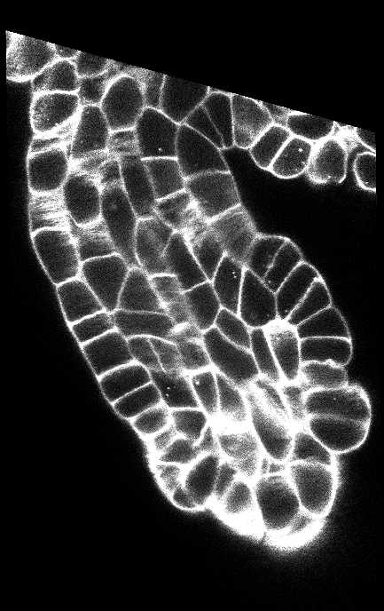
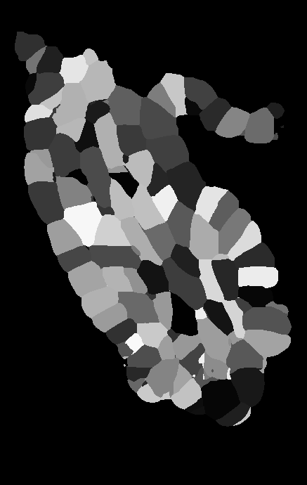
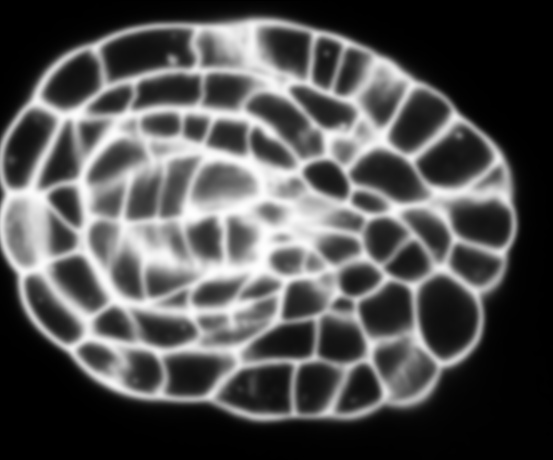
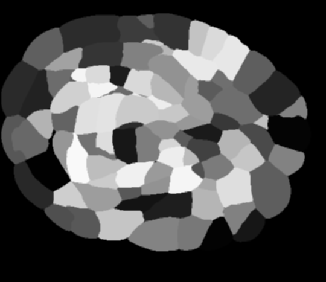

# Cell Wall Segmentation using ComboLoss Functions
The inspiration for this work is credited to Wolney et al. [1](#references)

## Dataset Overview
The dataset comprises of Thaliana Ovules and Thaliana Lateral Root that are obtained through Confocal Laser Scanning Microscopy and Light Sheet Fluorescent Microscopy (LSFM) respectively. A few samples of the dataset and their corresponding ground truth is shown as follows:

## References
1. Adrian Wolny, Lorenzo Cerrone, Athul Vijayan, Rachele Tofanelli, Amaya Vilches Barro, Marion Louveaux, Christian Wenzl, Sören Strauss, David Wilson-Sánchez, Rena Lymbouridou, Susanne S Steigleder, Constantin Pape, Alberto Bailoni, Salva Duran-Nebreda, George W Bassel, Jan U Lohmann, Miltos Tsiantis, Fred A Hamprecht, Kay Schneitz, Alexis Maizel, Anna Kreshuk (2020) Accurate and versatile 3D segmentation of plant tissues at cellular resolution eLife 9:e57613 https://doi.org/10.7554/eLife.57613
