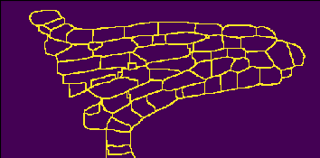

# Evaluating Cell Wall Segmentation with Different Loss Functions

The inspiration for this work is credited to Wolney et al. [[1]](#references)

## Dataset Overview

The dataset comprises of Thaliana Ovules and Thaliana Lateral Root that are obtained through Confocal Laser Scanning Microscopy and Light Sheet Fluorescent Microscopy (LSFM) respectively. A few samples of the dataset and their corresponding ground truth is shown as follows:

## Data Prepration

The cells are poorly mapped in the groundtruth data, which results in poor segmentation accuracy. Before training the groundtruth data is scrutinized for removing non-labelled data.

## Ground Truth Preparation

- Curation of boundary label from the ground truth mask
- Boundaries obtained by subtracting dilated image from eroded image
- Gaussian blur applied to thicken the boundaries
- Boundary mask generated by thresholding the output

The following sequence depicts the flow of data preparation:

## Data Augmentation

All input images were normalized with mean and std

- Random flipping on each axes
- Additive Gaussian Noise
- Additive Poisson Noise
- Elastic deformation
- All augmentation was applied with a random probability threshold of 0.5
- Results in more generalized inference from model on the given data

## Model Architecture

The U-Net architecture was used to train the dataset for performing segmentation. Some of the setup configuration for the model are presentaed below:

- Convolution padding changed to ‘same’ instead of ‘valid’
- Normalization layer is always followed by convolution and activation layers
- Group normalization is used for training with multiple patches
- Batch normalization is used when using a single patch for training
- Output channels reduced to one for binary segmentation
- A batch size of 1 is used
- Volume size stays at a constant value of 70 x 140, 140
- The kernel size is now 3 x 3 x 3 given 3D convolutions and max-pooling
- Batch norm is used given single batch size
- A Parametric ReLU is used for the activation function

### Model Weights Initalization

- Weight initialization prevents activation from exploding or vanishing in a forward pass 
- This results in loss being too big or too small to make the model converge
- U-Net weight initialization is done by drawing a gaussian distribution
- The output from gaussian distribution will have the same size as of the input
- Gaussian distribution is drawn with a mean of 1 and a std of √(2/𝑁), where N represents features in previous layer [[2]](#references)

### Optimizers

- Stochastic Gradient Descent (SGD) with momentum[[3]](#references)
- Great for traversing plateaus while learning
- Adaptive Movement Estimation (ADAM) with momentum and learning decay [[4]](#references)
- Great for sparse and noisy data
- For both optimizers, sigmoid activation was used on the final output from the model

### Loss Functions

Some of the loss functions used are listed as follows:

#### Dice Coefficient

- A region based loss
- Works by maximizing the intersection regions between output and target
- Loss computed by maximizing area with less intersection
- Dice loss considers both local and global information, hence more suitable for segmentation tasks
- Dice Loss is given by:

#### Focal Loss

- Binary image segmentation suffers with high bias towards foreground
- BCE produces good precision score but suffers in recall scores
- Focal loss penalises the BCE loss by minimizing loss for well classified examples
- This is done by down weighting the easy examples
- The loss function is given by:

#### Dice Focal Loss

- A compound loss
- Solves imbalanced classes problem in segmentation tasks
- The loss function is given by:

## Results

### 3D Segmentations

Some of the 3D segmentations we obtained are as follows:

### Lateral Root Primordia Segmentation

### Precision Recall F1 Scores

## Result Comparison

## References

1. Adrian Wolny, Lorenzo Cerrone, Athul Vijayan, Rachele Tofanelli, Amaya Vilches Barro, Marion Louveaux, Christian Wenzl, Sören Strauss, David Wilson-Sánchez, Rena Lymbouridou, Susanne S Steigleder, Constantin Pape, Alberto Bailoni, Salva Duran-Nebreda, George W Bassel, Jan U Lohmann, Miltos Tsiantis, Fred A Hamprecht, Kay Schneitz, Alexis Maizel, Anna Kreshuk (2020) Accurate and versatile 3D segmentation of plant tissues at cellular resolution eLife 9:e57613 <https://doi.org/10.7554/eLife.57613>
2. O. Ronneberger, P. Fischer, and T. Brox, “U-Net: Convolutional Networks for Biomedical Image Segmentation,” Lecture Notes in Computer Science, pp. 234–241, May 2015
3. N. Qian, “On the momentum term in gradient descent learning algorithms,” Neural Networks, vol. 12, no. 1, pp. 145–151, 1999
4. Kingma, Diederik, Ba, Jimmy, “Adam: A Method for Stochastic Optimization.” International Conference on Learning Representations, 2014.
5. J. Ma, J. Chen, M. Ng, R. Huang, Y. Li, C. Li, X. Yang, and A. L. Martel, “Loss odyssey in medical image segmentation,” Medical Image Analysis, vol. 71, p. 102035, Jul. 2021